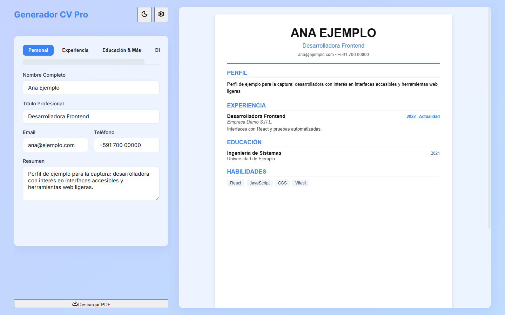
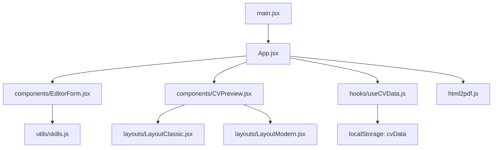

<div align="center">
  
  <h1>CVExpress</h1>
  <p><b>Arma tu currículum en el navegador, con vista previa en vivo, y descárgalo en PDF sin registrarte.</b></p>
  
  
  
  
  
  <br />
  <a href="https://github.com/Luiss2080/CVExpress/actions/workflows/ci.yml"></a>
  <p>
    <a href="#-inicio-rápido">Inicio rápido</a> ·
    <a href="#-características">Características</a> ·
    <a href="#️-arquitectura">Arquitectura</a> ·
    <a href="#-pruebas">Pruebas</a> ·
    <a href="#-lo-que-todavía-no-existe">Limitaciones</a>
  </p>
</div>

**CVExpress** es una aplicación web de una sola página que corre por completo en el navegador: no hay backend ni base de datos, y tus datos solo se guardan en el `localStorage` de tu equipo. Rellenas un formulario por pestañas, ves el CV en formato A4 y lo exportas a PDF. **No es** un servicio con cuentas, sincronización en la nube ni importación de CVs existentes.

## 🎬 Vista rápida

<p align="center">
  
</p>

<sub>Captura con datos ficticios ("Ana Ejemplo").</sub>

## ✨ Características

| Característica | Detalle (verificado en `src/`) |
| --- | --- |
| Editor por pestañas | Personal, Experiencia, Educación & Más y Diseño (`EditorForm.jsx`). |
| Vista previa en vivo | El CV se actualiza al escribir (`CVPreview.jsx`). |
| Dos plantillas | Clásico (`LayoutClassic.jsx`) y Moderno con barra lateral (`LayoutModern.jsx`), desde el modal de configuración. |
| Reordenar | Experiencia y educación se reordenan arrastrando (Framer Motion) o con los botones subir/bajar de cada tarjeta. |
| Diseño | Color de acento y tipografía (sans-serif, serif o monospace). |
| Modo oscuro | Solo para la interfaz del editor; el CV siempre va sobre fondo blanco. |
| Autoguardado | En `localStorage` (clave `cvData`) 500 ms después de cada cambio; con datos corruptos o incompletos usa valores por defecto. |
| Exportar | PDF A4 con `html2pdf.js` y respaldo `cv_data.json`. |
| Habilidades | Se guardan como texto separado por comas; se agregan sin duplicados (`utils/skills.js`). |

## 🏗️ Arquitectura



## 🚀 Inicio rápido

| Requisito | Versión |
| --- | --- |
| Node.js | 18 o superior (el CI usa 20) |

```bash
git clone https://github.com/Luiss2080/CVExpress.git
cd CVExpress
npm ci
npm run dev        # http://localhost:5173
```

Uso: completa las pestañas, abre el engranaje para elegir plantilla o exportar el JSON, revisa la vista previa y pulsa "Descargar PDF".

Otros comandos: `npm test`, `npm run lint`, `npm run build`, `npm run preview`.

<details>
<summary>Estructura de carpetas</summary>

```text
src/
  App.jsx, main.jsx, index.css
  components/   EditorForm, CVPreview, ui/AnimatedButton, ui/Modal
  layouts/      LayoutClassic, LayoutModern
  hooks/        useCVData
  utils/        skills
  tests/        skills.test.js, useCVData.test.jsx
.github/workflows/ci.yml   # lint + test + build en Node 20
```

</details>

<details>
<summary>Tecnologías (según package.json)</summary>

React 19, Vite 8, Framer Motion, lucide-react, html2pdf.js, CSS plano con variables. Pruebas: Vitest 5 + Testing Library sobre jsdom. Lint: oxlint.

`react-hook-form` y `react-icons` figuran en `package.json` pero no se importan en `src/`.

</details>

## 🧪 Pruebas

```bash
npm test
```

**18 tests** en 2 archivos (verificado): 7 del hook `useCVData` (valores por defecto, actualización, JSON inválido, migración de datos incompletos, persistencia con debounce) y 11 de `utils/skills`. El CI ejecuta lint, tests y build en cada push y pull request a `main`. No hay pruebas de los componentes de interfaz ni de la exportación a PDF.

## 🚧 Lo que todavía no existe

- Importar de vuelta un `cv_data.json` (hoy solo se exporta).
- Pruebas E2E o de la generación del PDF.
- Un solo CV por navegador: no hay múltiples perfiles.
- `npm run lint` avisa de una importación sin usar (`CheckCircle` en `EditorForm.jsx`), y el build advierte de un bundle mayor a 500 kB.
- El paquete se llama `temp_app` en `package.json` y hay dependencias sin uso.

## 📄 Licencia

MIT (ver [LICENSE](LICENSE)).

<div align="center"><sub>Hecho por Luiss2080 · Santa Cruz de la Sierra, Bolivia</sub></div>
